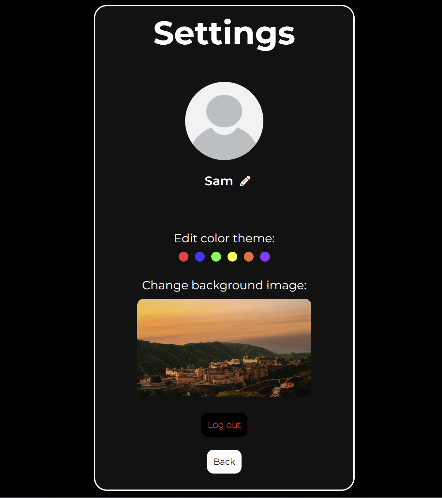

# Real-Time Chat Application

A full-stack real-time chat application built using Node.js, Express, Socket.IO, and MySQL.  
The project focuses on real-time communication, backend event handling, and persistent message storage.

## Overview

This application allows users to sign up, log in, search for contacts, and exchange messages instantly.  
WebSockets are used for low-latency communication, while MySQL stores user data, contacts, and messages.
This project was developed to understand real-time systems, event-driven architecture, and full-stack application flow.

## Features

- Real-time one-to-one messaging using Socket.IO
- User authentication (Sign up & Login)
- Contact search and contact list management
- Persistent message storage using MySQL
- Message deletion support
- Profile photo and background image customization
- Multiple UI themes stored per user
- Responsive user interface
- Event-driven backend design
- Groups and multimedia transfer functionalities yet to be added

## Tech Stack

**Frontend**
- HTML
- CSS
- JavaScript
- EJS
- Axios

**Backend**
- Node.js
- Express.js
- Socket.IO

**Database**
- MySQL

## How It Works

- Express handles routing, authentication, and API endpoints
- Socket.IO manages real-time message exchange between connected users
- MySQL stores users, messages, contacts, and user preferences
- Uploaded media files are designed as static assets
- Client-side JavaScript updates the UI dynamically using socket and API events

## Chat App UI

### Login & Signup

### Chat Interface

### Profile & Theme Settings

## How to Run Locally

1. Clone the repository:
2. Navigate to the project directory
3. Install dependencies (npm install)
4. Configure MySQL
5. Start the server using "node index.js"
6. Open "http://localhost:9000" in the browser
